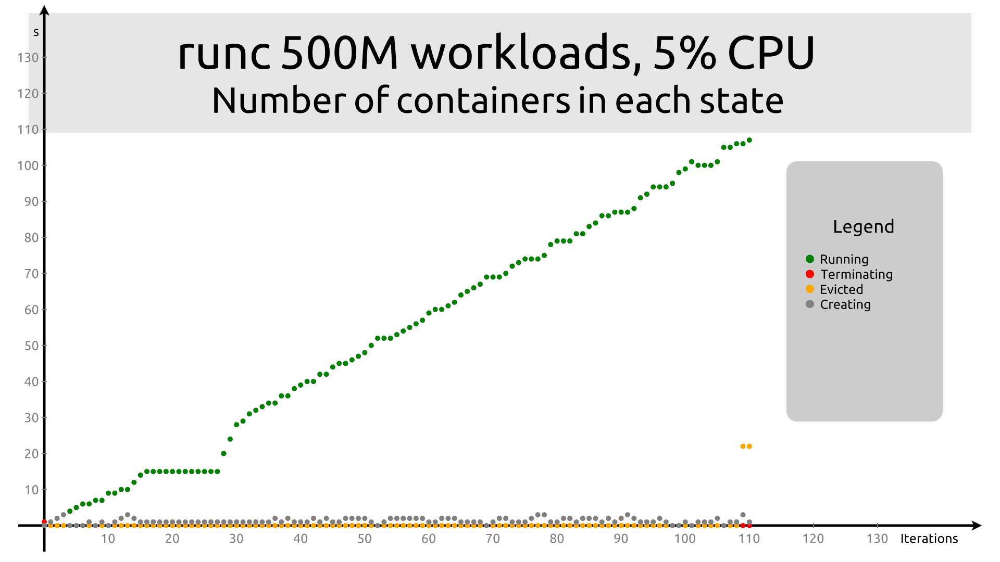

# Kata performance measurements

This is a series of measurements evaluating the performance and overhead of Kata
Containers, notably with respect to CPU and memory utilization and overhead.

### Summary

The following measurements have been performed:

1. [Memory capacity](memory-capacity.md): Determine the amount of memory that can
   be used for workloads, by incrementally adding 500M workloads to the system.

   * Objective: Estimate "memory overhead" by checking how many calibrated
     containers we can run on a reasonably-sized cluster.

   * Result: `runc` maxes out at around 377 containers (reaching saturation
     around the predicted 160), whereas `kata` maxes out at 134 only. The memory
     usage per container with `runc` is between 200M and 600M per container,
     with `kata` it is between 600M and 1200M (in both case with 500M used by
     the workload).

2. [Memory-hungry workload](memory-hungry.md): Running memory-hungry
   workloads that try to grab as much memory as possible from the system.

   * Objective: Check the effect of running the workload in a fixed-sized
     pod/VM (each VM having a default 2G memory allocation)

   * Result: In this context, `kata` seems unable to use half of the available
     memory.The total memory utlization never exceeeds ~35G out of 80G. This
     result is unexpected, and requires investigation. Each container receives
     less memory (200M-400M for `kata`, 600M for `runc`). In that case, both
     `runc` and `kata` both saturate at 102-103 containers.

3. [Memory-restricted workload](memory-restricted.md): Running a
   workload with a memory request below what it will use, and a memory limit
   just above.

   * Objective: Check the impact of memory hot-plugging in `kata`, and how well
     memory constraints are obeyed.

   * Result: In this case as well, `kata` ends up being able to use far less
     memory than predicted. Total memory utilization never exceeds 30G out of 80G.
     Containers also receive much less memory than with `runc` (between 200M and
     400M vs. 600M with `runc`). In this case, `kata` seems to be able to run a
     slightly higher number of containers (102 vs 92).

## Methodology

1. In order to minimize the measurement noise, I created a very simple
   [workload][workload] that consumes a configurable amount of CPU and memory.

2. This workload is put [in a container][workloadc] so that it is easily
   consumed by Kubernetes / OpenShift.

3. [Deployments][deploy] with variations on the parameters can then test how the
   orchestration deals with increasing pressure, or scheduling behavior.

4. [Increase some of the parameters][scale] continuously, until some
   cluster-wide limit is reached. Generally, the cluster becomes barely
   responsive at that stage, which makes the limit fuzzy.

5. Collect the data in CSV files and present a [graphic visualization][graphs] of
   the data and a text analysis of the data.

[workload]: https://github.com/c3d/workload
[workloadc]: https://quay.io/c3d/workload
[deploy]: workload.yaml
[scale]: scale.sh
[graphs]: visualize.ddd

### Configuration used for the tests described in this document

The tests are run on a system with 64 physical CPUs (PCPUs) and 384MB of memory.
A cluster is running on that system, which consists of the following nodes:

1. A provision host with 8 virtual CPUs (VCPUs) and 16G of memory.

2. Three master nodes with 16 VCPUs and 32G of memory each

3. Five worker nodes with 8 VCPUs and 16G of memory each.

The total of memory allocated to VMs is therefore 192G, so there will be no
memory oversubscription.

Of this total amount, 80G (5*16) can in theory be allocated to workloads. In
practice, experience shows that we get significantly less usable memory.

### Curves

The memory plots made with [Tao3D][tao3d] show

* Active memory in red, the larger dots being the sum of all nodes, and the
  small dots being the free memory for each individual node

* Free memory for the nodes in green, with the same conventions.

[tao3d]: https://tao3d.sourceforge.net

### Evolution of the test plan

The original idea of the test plan was to run an `oc scale` command with an
increasing number of replicas, and at each step, to measure how long it took to
reach steady state.

Experimentally, this approach turned out to not work very well, because steady
state was never really achieved once the cluster reached saturation.
Since the objective of the measurements is to determine the behavior of the
cluster at memory and CPU saturation, it is difficult to reach solid conclusion
if the time to get there increases asymptotically and we never see what is
"beyond" saturation.

So the test script was modified to _not_ wait and instead keep increasing the
load at fixed intervals.

#### Runs with wait

The [configuration in that scenario](workload-runc.yaml) does not set the
`RuntimeClass` to `kata`, so we use the defualt runtime. Given that we have
about 80G of available memory and that each workload is tuned for 500M, we
expect to be able to run at most 160 instances. In practice, things start going
wrong between 100 and 120, and the system becomes quite unresponsive, e.g. with
`ssh` disconnects (the script had to be adjusted to take that into account).

The memory utilization shows a very linear behavior up to about 100
loads. Several runs were made, waiting for the number of containers to
stabilize. With this approach, it was not possible to exceed ~123 containers,
the system thrashing a lot, but the script was not collecting data.

The number of containers increases linearly quite well until some limit is
reached and memory cannot be allocated anymore.

The timing shows some random spikes, and brutally spikes up to the point where
the experiment had to be stopped.

#### Fixed-wait runs

The approach where the script was actually waiting for the requests to be
completed does not work correctly after reaching saturation. So the script was
modified to instead wait a fixed amount of time, which will better capture the
dynamic behavior of the system. The benefit of that approach is that it allows
runs that have a somewhat fixed duration, and it makes it possible to request
scaling well above the maximum the system can tolerate.

With these changes, the results are as follows:

The number of containers increases linearly quite well until some limit is
reached and memory cannot be allocated anymore.

The timing shows some random spikes, and brutally spikes up to the point where
the experiment had to be stopped.

#### No-wait runs

The delay in the script really serves no real purpose - There are plenty of
other delays just comminicating with OpenShift (the `oc` command is not
especiallty fast, and `ssh` gets worse with load). So removed it and did another
"fast" run. Also changed the method to gather memory stats from the various
workers: keep one `ssh` connexion per host instead of reopening it every
time. The risk is if that connexion gets killed, but worst case is we get
"constant" memory data for that node.

This leads to the following results:

Surprisingly, the number of running containers seems to grow well beyond what
would be predicted from basic memory analysis, with a plateau around 400 rather
than the predicted 160. Maybe swap is activated with OpenShift (unlike
Kubernetes)? Looking at `top`, apparently not. So maybe it's killing containers
(hence the high number of evicted) to make room for more, and takes advantage of
the fact that `workload` is intended to grow memory relatively slowly?

The timing with this new approach shows good proportionality, with an almost
perfectly linerar duration for operations.

At the end, the host has a load average of about 50, and CPU utilization is well
below 100% of all 64 PCPUs.

This last approach is what was retained for the following runs.

## Test results
