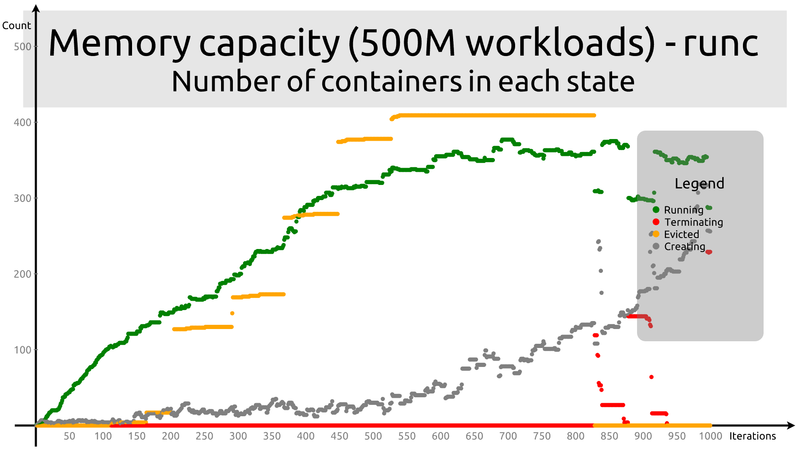
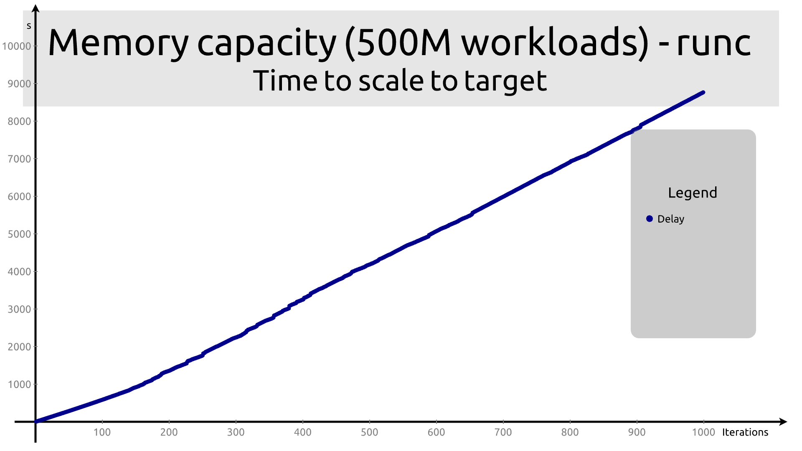

# Memory capacity

In this test run, the workload is configured to consume 500M of memory quickly
(256M increment) using 5% of CPU. The deployment file looks as follows:

```
apiVersion: apps/v1
kind: Deployment
metadata:
  name: workload-deployment
  labels:
    app: workload

spec:
  replicas: 1
  selector:
    matchLabels:
      app: workload
  template:
    metadata:
      labels:
        app: workload
    spec:
      # The following line is what changes between kata and runc
      runtimeClassName: kata
      containers:
      - name: workload
        image: quay.io/c3d/workload
        env:
        - name: CPU
          value: "5"
        - name: MEMORY
          value: "500"
        - name: INCREMENT
          value: "256"
```

## Memory utilization

As expected, memory utilization is significantly higher for `kata` than `runc`.

Since the cluster offers 80G of available memory, we expect that the theoretical
maximum we should get with our 500M containers is 160 active containers. In
practice, we get rather close to that limit with `runc`. Memory starts tapering
out around 120, and completely flattens around 150. Interestingly (and somewhat
unexpectedly), active memory _decreases_ slowly as you increase the number of
containers beyond the limit.


With `kata`, memory saturation is reached around 50 containers, and memory
utilization beyond that is much more erratic, presumably because the death of a
VM frees a lot of additional memory. The plots suggests that the scheduler frees
a little too many pods at a time. Saturation is also a bit more brutal and
noisy.


## Memory per container

The memory usage per container is also much more erratic with `kata` than with
`runc`. It is measured here as the ratio between total active memory in the
cluster by the number of running containers.

With `runc`, memory per container decreases smoothly. At memory saturation, it
is as we can expect of roughliy 500M per container, so at that stage, the
cluster uses almost all of its memory for containers. After that, the memory per
container decreases until it reaches about 200MB. This is the point where the
cluster kills containers to reclaim memory as fast as it creates them.


With `kata`, memory usage per container never goes below ~550M. At the point
where the system reaches saturation each container uses roughly 1G of
memory. Surprisingly, even _after_ reaching saturation, there are still peaks to
1200MB, presumably because the cluster kills containers to make space but they
take time to die.


## Container states

The number of containers in each state is where the differences between the two
runtimes is the most clear-cut.

With `runc`, as we reach saturation, the number of containers running keeps
increasing, and increases far beyond the predicted 160. Overall, the system
manafged to get almost 400 containers running until the number reaches a
plateau. Remember that the containers do not immediately consume their 500M of
memory, and this allows the orchestration to fit more of them on the cluster.

The number of containers evicted seems to progress in steps, until we run about
500 containers, at which point the number of evicted containers out remains
stable until ~800 containers. Another behavior appears at that point, where
terminating containers start to appear and the number of evicted containers
falls down to zero. At that point, the number of running containers also starts
becoming noisy and bumpy.



The picture with Kata Containers is much less pretty. The plateau in that case
is reached at around 120 containers. We see terminating containers right from
the beginning, and no evicted containers at all. The nymber of creating
containers is all over the place, and the number of running containers becomes
unpredictable once we request more than 500.


## Timing

Since the scripts do not wait any longer, the timing is roughly similar between
`Kata` and `runc`. In both cases, the script takes ~9000s to complete.




## Analysis

Naive analysis predicts that we can fit about 160 containers of 500M each on the
cluster, since it offers 80G of memory.

In practice, `runc` starts saturating at around 120, but manages to consistently
run more than 350 containers simultaneously, with a 377 maximum.

By contrast, `kata` starts saturating at around 50, and has trouble keeping more
than 100 containers running, with a somewhat erratic behavior when more than 500
are requested. The maximum number of containers it runs successfully is 134, but
that number brutally falls down to 105 immediately afterwards.

If we estimate the memory overhead based on number of containers to reach
saturation, then

* `runc` hits the limit around 160, (going below 1G of total free memory at
  iteration 163),

* `kata` around 50 (going below 1G at iteration 46).

* This gives an overhead of 254%.


If we estimate the memory overhead base on the number of containers that can be
run on the system, then

* `runc` can run 377 containers

* `kata` can run 134 containers

* The overhead with these metrics is 181%


If we estimate the overhead using memory per container at saturation, then

* `runc` uses about about 600M per container

* `kata` uses about 1400M per container

* The overhead is 130%, or a static overhead of ~800M per container.


If we estimate the overhead using best-case memory per container, then

* `runc` goes as low as about 200M per container

* `kata` requires between 600M and 1200M per container

* This results in an overhead of 200% to 500%, and 400M to 1G per container.


The exact same run as above with Kata gives a somewhat different picture.

Memory saturation occurs much earlier, around 50 containers instead of
around 100.


## Other observations

The number of containers shows several important differences:

1. The number of containers in "Terminating" state is almost constantly
   non-zero with `kata`. This probably indicates that the shutdown of containers
   is much more expensive and takes longer.

2. `kata` delivers an overall much more noisy performance

3. No container is reported as being in "Evicted" state. No good explanation.

4. The time to start containers does not seem overly affected by the use of Kata,
   but remember that this is running without any wait loop.

5. The kata run lead to a number of failures, e.g. on `worker-0-3`:

   ```
   Failed Units: 4                                                                                     │   6474 root      20   0 1900.9m  30.5m   9.9m S   0.7   0.2 514:43.34 coredns
     crio-02444895f9da0e669e089e824a81a49cd4a2a7f8ed3e4c4f4899aab1749be7ba.scope                       │   7886 root      20   0  729.5m  29.8m   0.0m S   0.0   0.2 238:08.16 ovnkube
     crio-16bd293f29c2950dfc6b82dcad5b31dfd17084c15e500282b27e2458da0d8c1f.scope                       │1784616 root      20   0 1950.5m  28.9m   0.1m S   0.0   0.2  25:46.16 podman
     crio-816d50032afdfdfb0423085ae547a3707add8ab6aa4b018be2ee0bd8b8c2f56a.scope                       │   7702 nfsnobo+  20   0  770.9m  28.7m   0.0m S   5.6   0.2 231:18.82 node_exporter
     crio-9434ab7db7ff88a734b86f2eaaaeda85bf3e5d301c685b9628b1290f683345cf.scope
   ```

6. Two workers stayed in `NotReady`:

   ```
   worker-0-1.kata-c3d-48-0.qe.lab.redhat.com   NotReady   worker   10d   v1.20.0+39c0afe              │KReclaimable:     182036 kB
   worker-0-2.kata-c3d-48-0.qe.lab.redhat.com   NotReady   worker   10d   v1.20.0+39c0afe
   ```

   I cordoned and rebooted the workers, and that seems to fix the `NotReady`, but I
   still have a large number of containers that remain in `Terminating` state. This
   impacts the states shown in the next runs, as I could not fully eliminate the
   `Terminating` pods (there are still 35 of them after 3 days).
