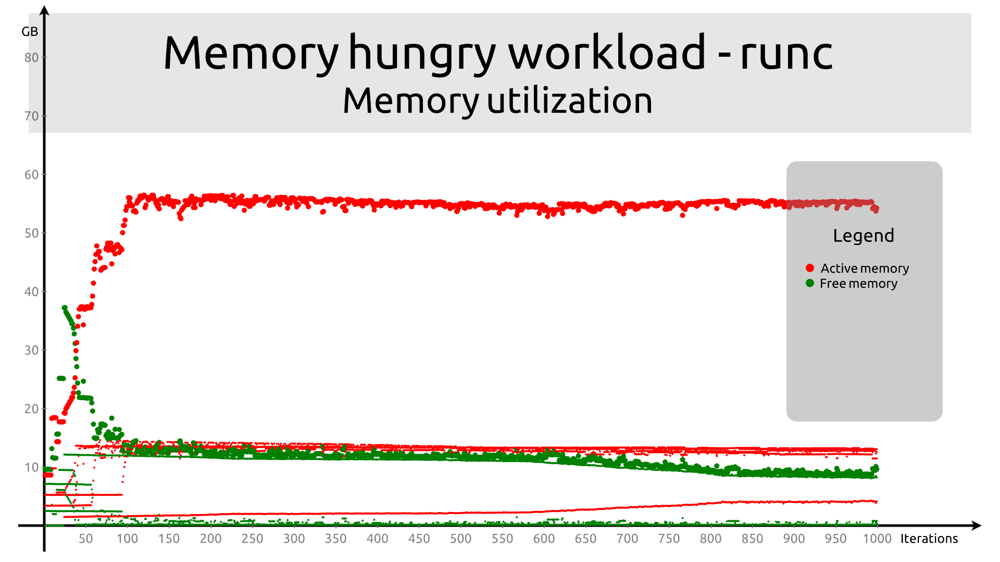
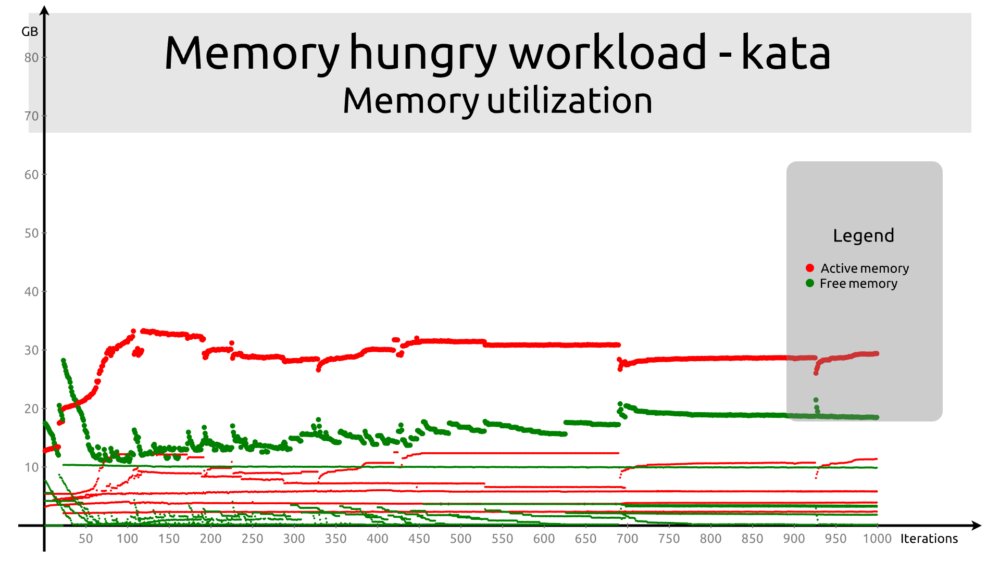
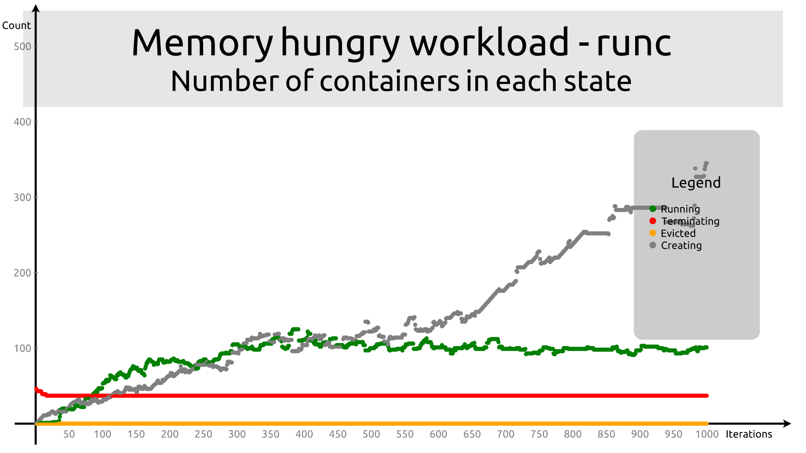
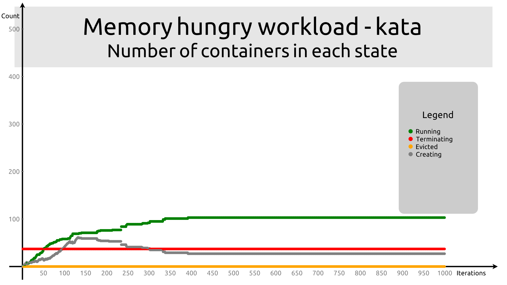
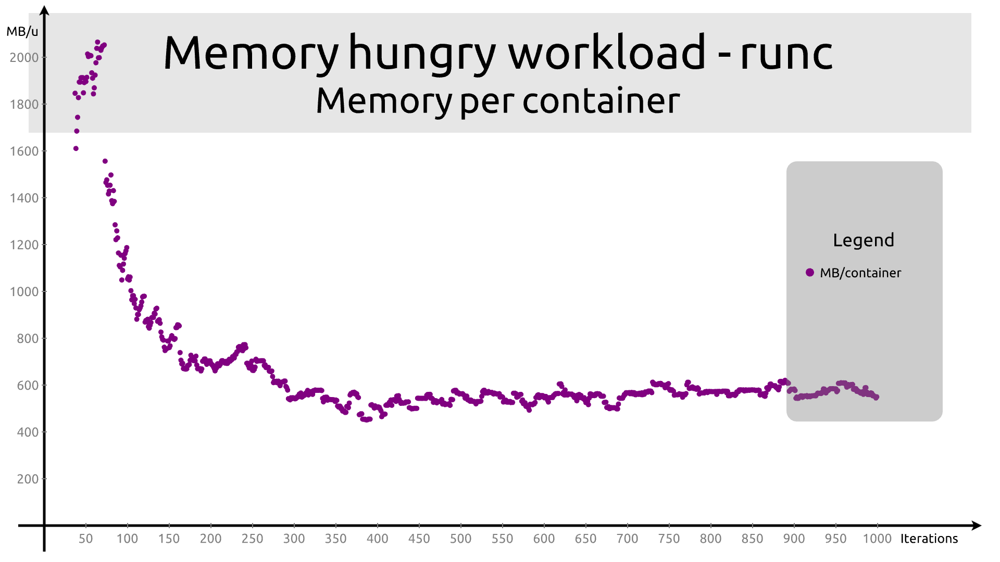
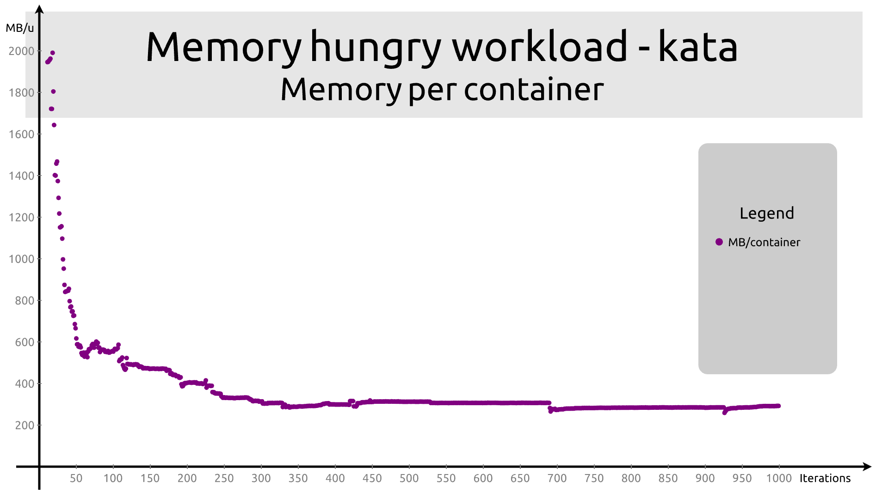

# Memory-hungry workload

In this run, we use set the value of `MEMORY` to `0`, which causes the workload
to leak memory like a sieve. The `INCREMENT` is set to a lower value in order to
let memory usage to increase a bit more slowly over time. As a result, the
expectation is that the containers will be evicted more often.


```
apiVersion: apps/v1
kind: Deployment
metadata:
  name: workload-deployment
  labels:
    app: workload

spec:
  replicas: 1
  selector:
    matchLabels:
      app: workload
  template:
    metadata:
      labels:
        app: workload
    spec:
      runtimeClassName: kata
      containers:
      - name: workload
        image: quay.io/c3d/workload
        env:
        - name: CPU
          value: "5"
        - name: MEMORY
          value: "0"
        - name: INCREMENT
          value: "25"
```

## Memory utilization

The behavior of `runc` is as follows:



The behavior of `kata` is as follows:



In that scenario, `kata` seems to behave much better than `runc`. So much
better actually that I suspect I somehow swapped the `kata` and `runc` data
files. However, we see a relatively similar behavior on memory-restricted
workloads as well, so it seems like the behavior is genuine.

However, the fact that the memory utilization does not exceed 4G may explain
it. One possible interpretation is that containers in Kata are restricted by the
size of the VM, so they never exceed 2G, whereas with `runc` they may go above
that.

## Container states

Container states also seem more stable for Kata in that case. The number of
containers in `terminating` state seems to be a leftover from a previous run,
i.e. containers that will just not go away.






## Memory per container

Memory per container is also behavior strangely more noisy with `runc` than with
`kata`.




