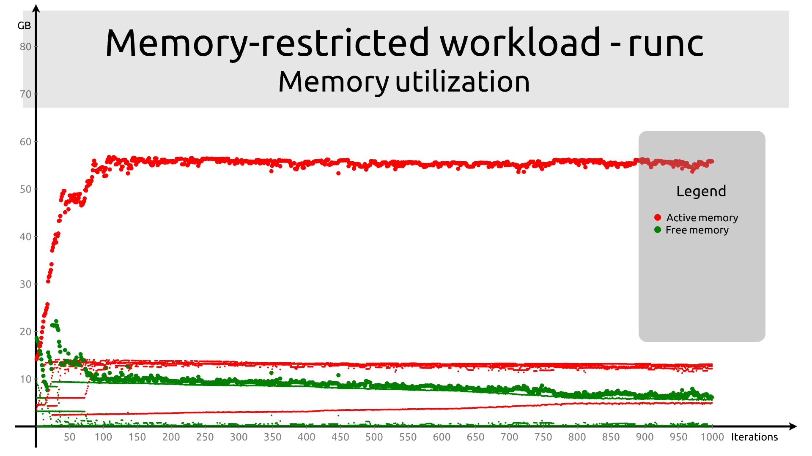
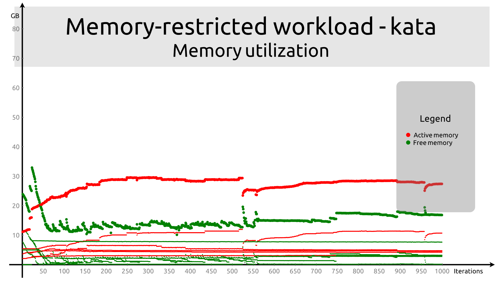
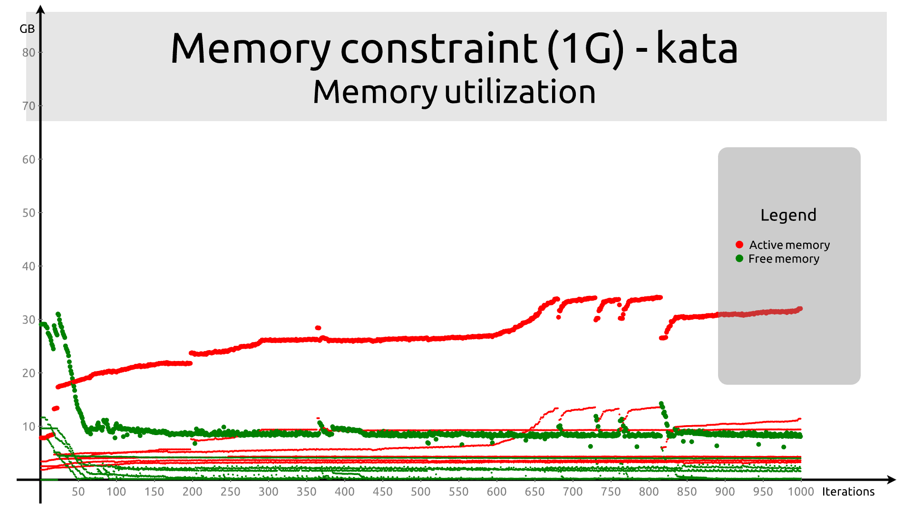
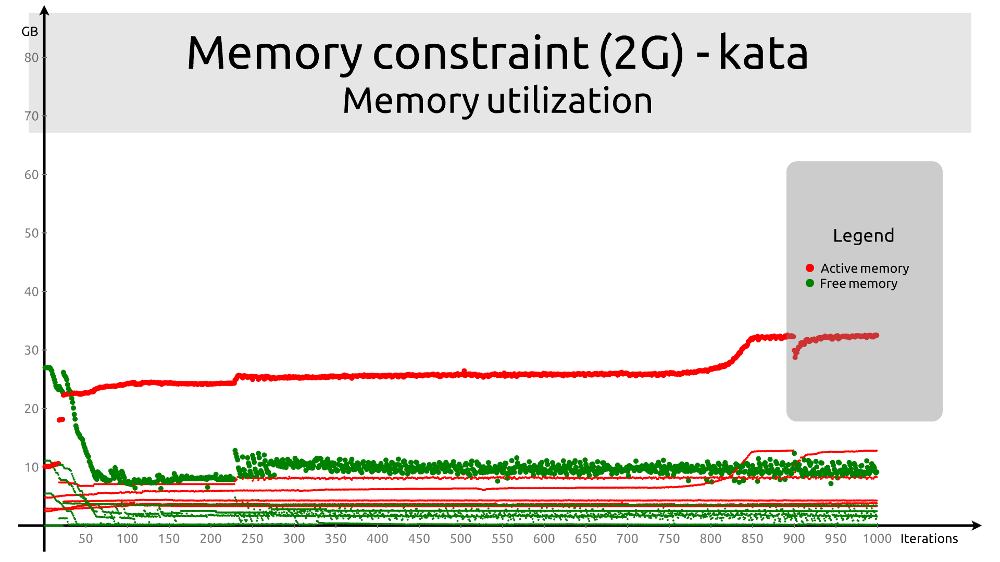
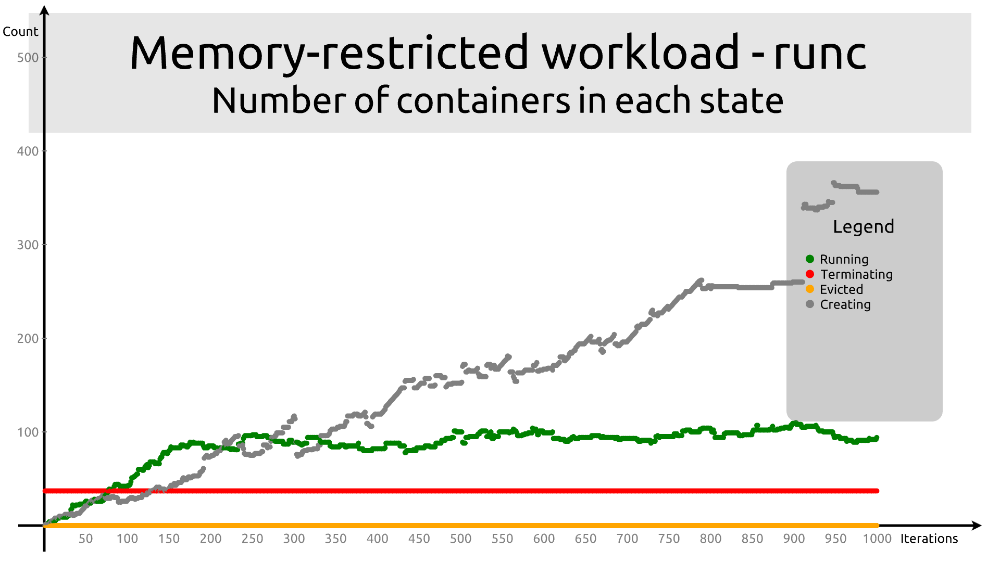
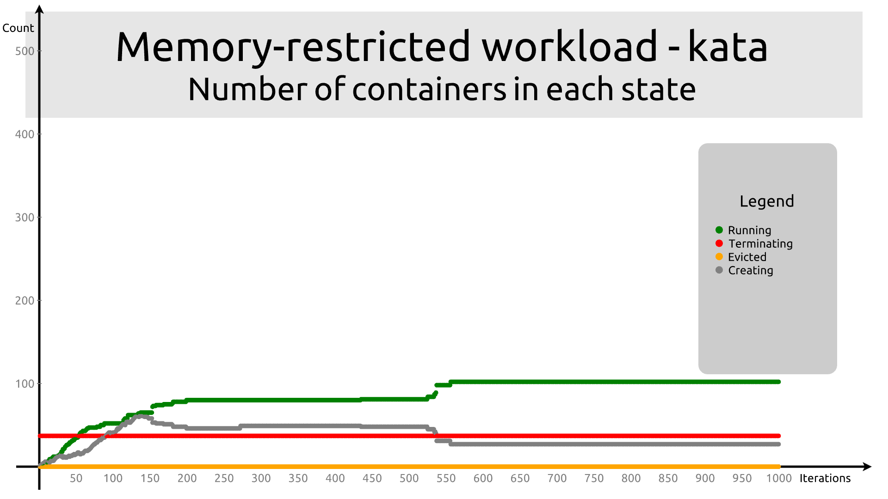
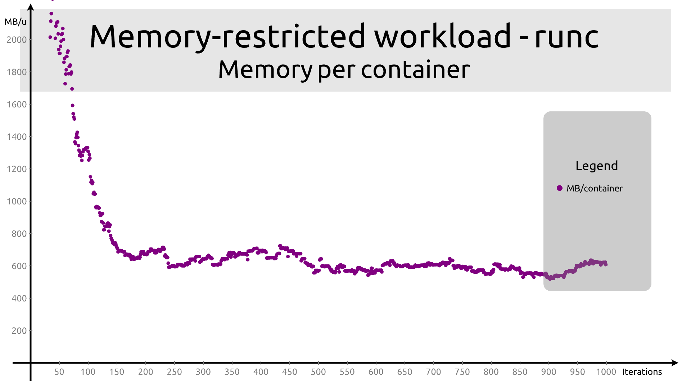
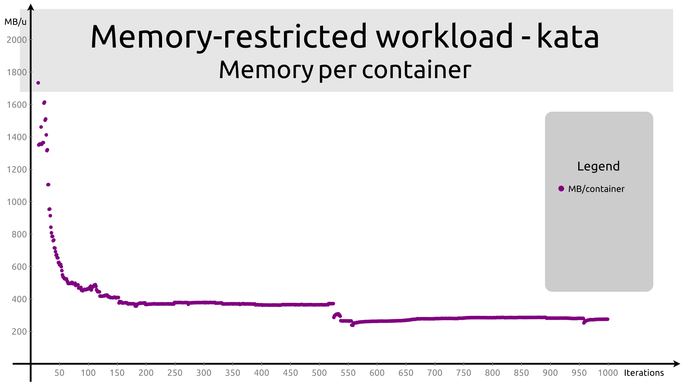

# Memory-restricted workload

In this scenario, we give the workload some fixed memory, and set a hard limit
for it just above what it's supposed to consume. The container is requested to
consume 500M, the limit is set at 512M.

```
apiVersion: apps/v1
kind: Deployment
metadata:
  name: workload-deployment
  labels:
    app: workload

spec:
  replicas: 1
  selector:
    matchLabels:
      app: workload
  template:
    metadata:
      labels:
        app: workload
    spec:
      runtimeClassName: kata
      containers:
      - name: workload
        image: quay.io/c3d/workload
        env:
        - name: CPU
          value: "5"
        - name: MEMORY
          value: "500"
        - name: INCREMENT
          value: "250"
      resources:
        requests:
          memory: 384Mi
        limits:
          memory: 512Mi
```

## Memory utilization

The behavior of `runc` is as follows:



The behavior of `kata` is as follows. Once again, `kata` does not use more than
roughly half of all available memory. It's unclear why the sum of "active" and
"free" memory is so far below total memory in this scenario. This seems to
indicate that the pod overhead for that scenario may cause the scheduler to be
too conservative?



The theory that this is related to having a limit can be explored by setting the
size and limit to higher values. With 1G allocated and a 2G limit, the graph is:



With 2G allocated and a 4G limit, the graph is:



So the problem does not arise from the value of the memory limit itself.


## Container states






## Memory per container




